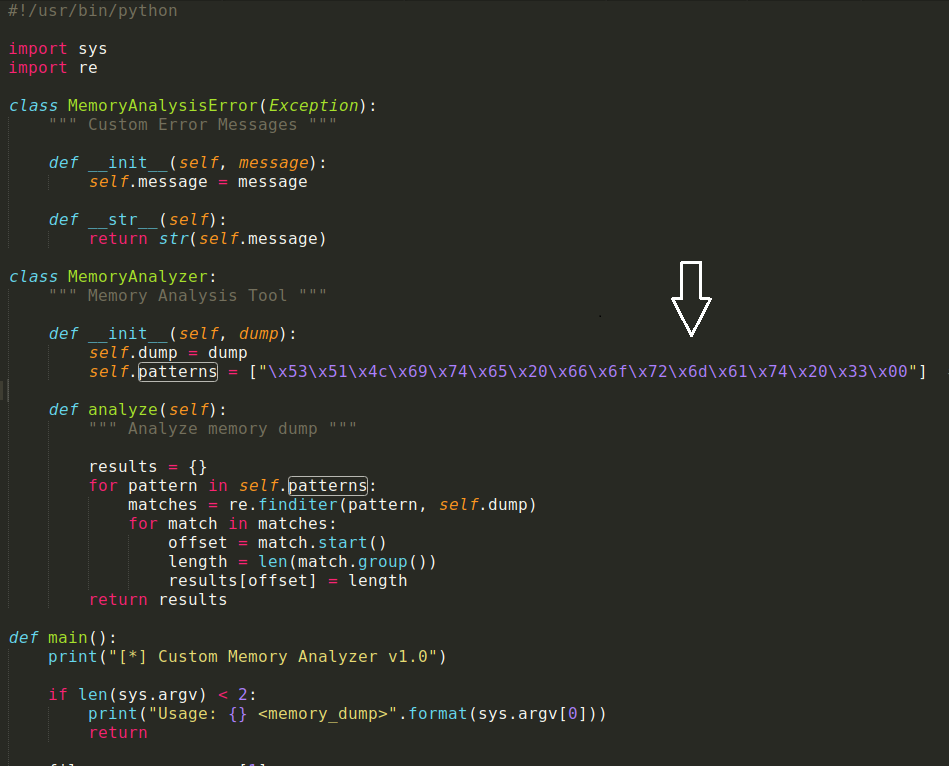
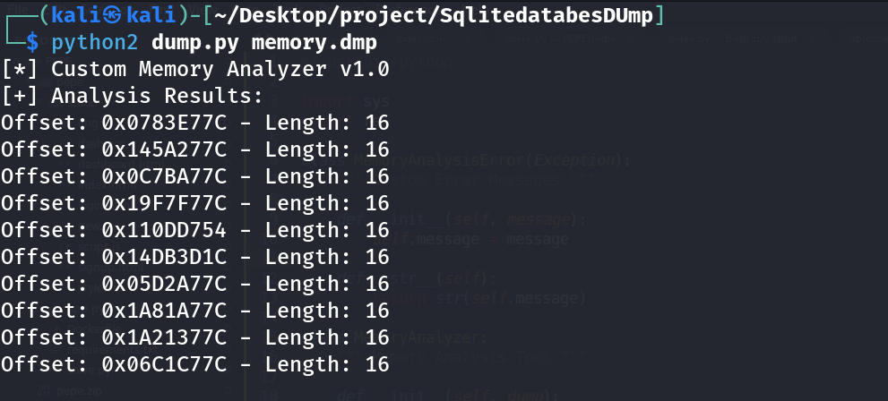

# Custom Memory Analysis Tool

* This script is a custom memory analysis tool designed to analyze memory dumps using user-defined patterns. It's a simplified version that focuses on generic memory analysis without specific module functionalities.

# Requirements

* Python 2

# Preview

* List of custom patterns for analysis u can edit here is set for SQLlite3 databases.
  

* Output the offset and the lenght (u can use tools like volatility to extract those)

# Feature

* Customizable Patterns: Users can define their own patterns for analyzing memory dumps, allowing flexibility in data extraction.
